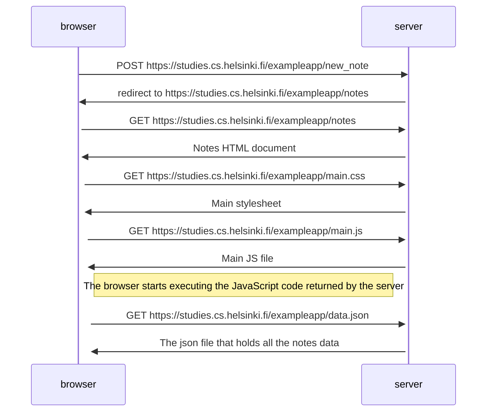

```mermaid
sequenceDiagram
participant browser
participant server

browser ->> server: POST https://studies.cs.helsinki.fi/exampleapp/new_note
activate server
server ->> browser: redirect to https://studies.cs.helsinki.fi/exampleapp/notes
activate browser
browser ->> server: GET https://studies.cs.helsinki.fi/exampleapp/notes
activate server
server ->> browser: Notes HTML document
activate browser
browser ->> server: GET https://studies.cs.helsinki.fi/exampleapp/main.css
activate server
server ->> browser: Main stylesheet
activate browser
browser ->> server: GET https://studies.cs.helsinki.fi/exampleapp/main.js
activate server
server ->> browser: Main JS file
activate browser
Note right of browser: The browser starts executing the JavaScript code returned by the server
browser ->> server: GET https://studies.cs.helsinki.fi/exampleapp/data.json
activate server
server ->> browser: The json file that holds all the notes data
activate browser
```
